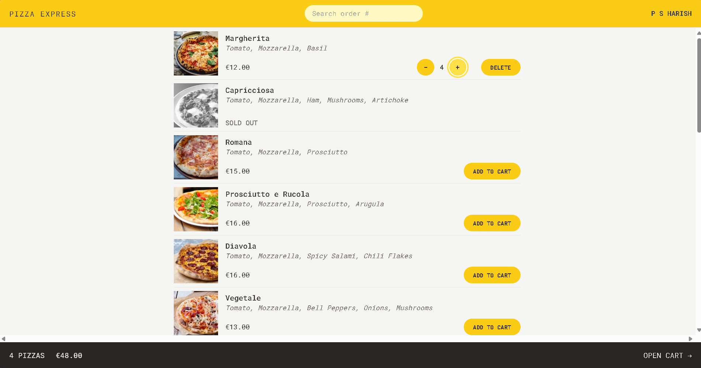

<h1 align="center">Pizza Express</h1>

<h2 align="center">

[🌐WebSite](https://pizza-express-phi.vercel.app/)

</h2>

<!-- Badges -->
<div align="center">


[](www.linkedin.com/in/psharish27)

</div>

<!-- Brief -->
<p align="center">

</p>

<!-- Screenshot -->
<a align="center" href="https://pizza-express-phi.vercel.app/">



</a>

## Key Features

- Very simple application, where users can order one **or more pizzas from a menu**
- **Requires no user accounts** and no login: users just input their names before using the app
- The pizza menu can change, so it should be **loaded from an API**
- Users can add multiple pizzas to a **cart** before ordering
- Ordering requires just the **user's name, phone number**, and **address**
- If possible, **GPS location** should also be provided, to make delivery easier
- User's can **mark their order as "priority"** for an additional 20% of the cart price
- Orders are made by **sending a POST request** with the order data (user data + selected pizzas) to the API
- Payments are made on delivery, so **no payment processing** is necessary in the app
- Each order will get a **unique ID** that should be displayed, so the **user can later look up their order** based on the ID
- Users should be able to mark their order as "priority" order **even after it has been placed**

## Built with

- [React](https://reactjs.org) - A JavaScript library for building user interfaces
- [Redux Toolkit](https://redux-toolkit.js.org) - A simplified, efficient, and powerful Redux library for building state management systems
- [Tailwind CSS](https://tailwindcss.com) - Utility-first CSS framework for building any design
- [Vite](https://vitejs.dev/) - A JavaScript module bundler and development server.


## Installation

- Clone this repo:

```sh
git clone https://github.com/hydraharish123/pizza-express.git
```

- Install dependencies:

```sh
npm install
```

- Live server:

```sh
npm run dev
```

## Author

<b>👤 P S Harish</b>

Feel free to contact me with any questions or feedback!

## Credits

This app was created as part of [Jonas Smechmann's](https://twitter.com/jonasschmedtman) Udemy course named [The Ultimate React Course 2023: React, Redux & More](https://www.udemy.com/course/the-ultimate-react-course)
